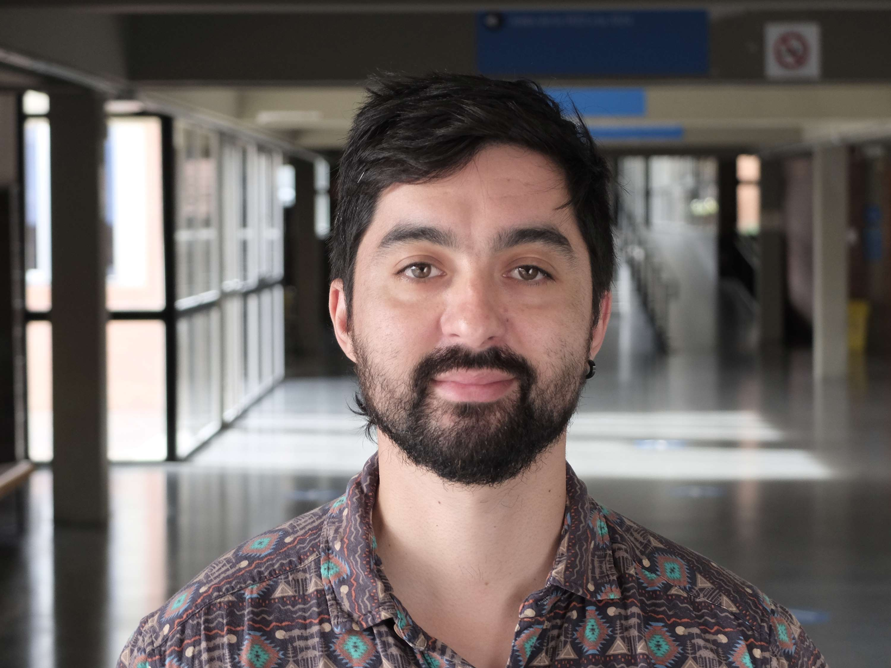

-<!DOCTYPE html>
<html lang="en">
<head>
  <meta charset="UTF-8">
  <meta name="viewport" content="width=device-width,initial-scale=1">
  <title>Sebastian Ritter</title>
  
</head>
<body>

  <nav>
    <a href="#home">Home</a>
    <a href="#research">Research</a>
    <a href="#conferences">Conferences</a>
    <a href="#cv">CV</a>
  </nav>

  

    <aside>
      
      <h2>Sebastian Ritter</h2>
      
PhD Candidate in Economics

      

        ✉️ <a href="mailto:sebastianritter@ub.edu">sebastianritter@ub.edu</a> 
        🔗 <a href="https://www.linkedin.com/in/sebastian-ritter-85033b100" target="_blank">LinkedIn</a>
      

      

        <strong>Connect:</strong> 
        <a href="https://github.com/sebaritterg" target="_blank">GitHub</a> 
        <a href="https://scholar.google.com" target="_blank">Google Scholar</a> 
        <a href="https://twitter.com/yourhandle" target="_blank">Twitter</a>
      

      
<a href="assets/pdf/cv_ritter.pdf" target="_blank">Download CV (PDF)</a>

    </aside>

    <main>
      <section id="home">
        <h1>Home</h1>
        
I am a PhD student in Economics at the University of Barcelona, supervised by Vicente Royuela. My research focuses on the economics of migration—linguistic barriers, digital/green transitions and environmental migration—and regional economics & spatial analysis with causal-inference methods.

      </section>

      <section id="research">
        <h2>Research</h2>
        <h3>Published Papers</h3>
        <ul>
          <li><strong>The economic effect of splitting a region in a centralized country: A case from Chile.</strong> To be published in <em>Global Challenges & Regional Science.</em></li>
        </ul>
        <h3>Work in Progress</h3>
        <ul>
          <li><strong>Twin Transition effects on human (Im)mobility: a multilevel model analysis.</strong></li>
          <li><strong>Do language policies affect internal migration in a multilingual country?</strong></li>
        </ul>
      </section>

      <section id="conferences">
        <h2>Conferences and Seminars</h2>
        <ul>
          <li><strong>Twin Transition Effects on Human (Im)mobility</strong> – XLVIII International Conference on Regional Science, Oct 16–18, 2024, Cuenca, Spain.</li>
          <li><strong>Do Language Policies Affect Internal Migration?</strong> – ERSA Congress (Azores, Aug 2024); Labour Economics Meeting (Barcelona, Jul 2024); RSA Annual Conf. (Florence, Jun 2024).</li>
          <li><strong>The Economic Effect of Splitting a Region: A Case from Chile</strong> – VI Seminar for New Academic Researchers, Sep 14–15, 2023, Barcelona.</li>
          <li><strong>Dynamics of Regional and Communal Employment…</strong> – First South Congress, Aug 7, 2019, Valdivia, Chile.</li>
        </ul>
      </section>

      <section id="cv">
        <h2>Curriculum Vitae</h2>
        
<a href="assets/pdf/cv_ritter.pdf" target="_blank">Download my full CV (PDF)</a>

      </section>
    </main>
  

  <footer>
    &copy; Sebastian Ritter
  </footer>
</body>
</html>
